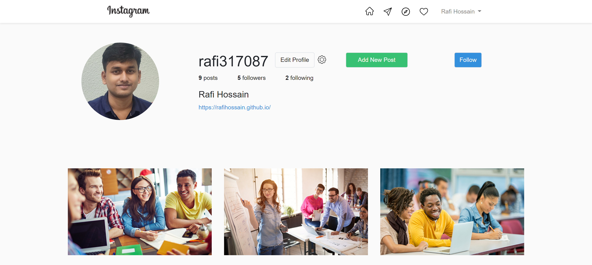
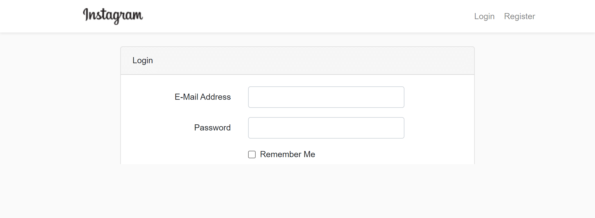
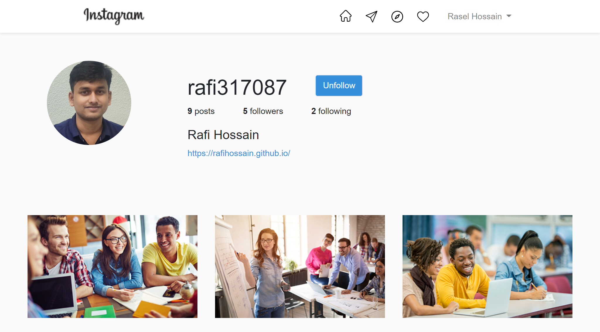

<h2>Instagram Clone:</h2>

•	Follow and unfollow option. 
•	Edit profile and change profile image. 
•	resizing image's from scratch. 
•	Add a new post with your one caption and choose your image. 
•	logout, user, authentication and registration features.  
Technology Used: 
	Laravel, PHP, MySQl, Html, Css, Bootstrap, Vue.js.

<h3>Project Screenshot</h3>
  
  
  
  
<h3>Installation</h3>

Clone the repo git clone https://github.com/rafihossain/instagram-clone-project.git
cd to project folder.

1) Run composer install

Save as the .env.example to .env and set your database information for this type

2) copy .env.example .env

3)Run php artisan key:generate to generate the app key

4)Run npm install

5)Run php artisan migrate

6)Run php artisan storage:link

7)Run php artisan serve

create profile... upload image and Enjoy...
